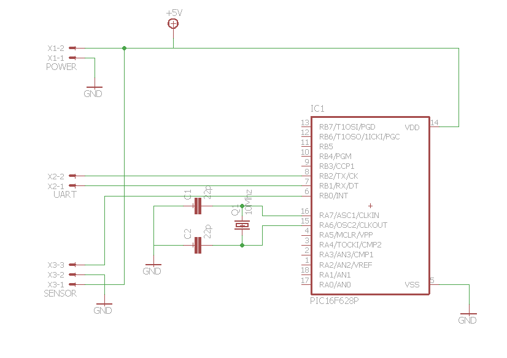
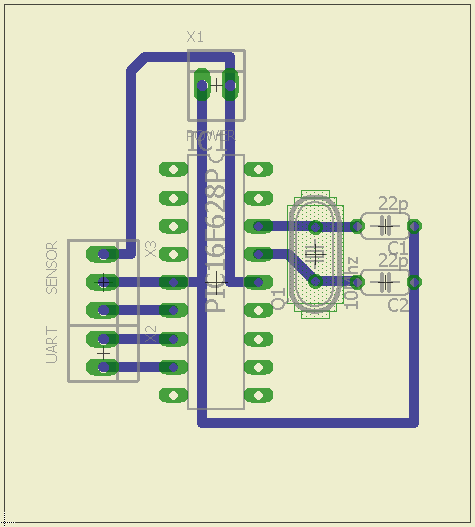
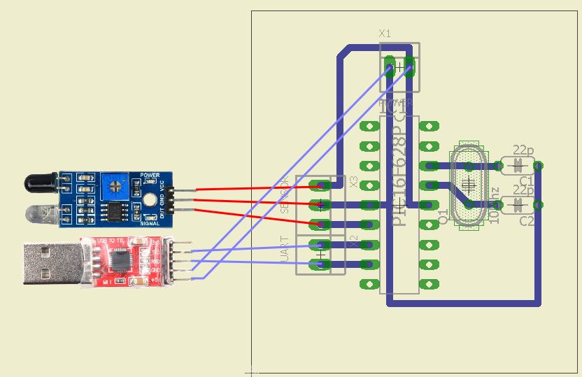

# PicTachometer
Tachometer to test &amp; adjust the rotation speed of **Commodore 1541** floppy drives

Basically, this project is an event counter with a window of 60 seconds, using an **PIC16F628A**.

For sensor I used an commonly available **IR sensor module** or *IR Infrared Obstacle Avoidance Sensor Module*.  
And to display the data I'm using an **USB to UART converter** with a baud rate of *57600*.

I usually use it to check and adjust the rotation speed of **Commodore 1541** floppy drives.  
It can be used anywhere when you need to count the number of events on a minute.  
Making minor changes in the code you can use it as generic event counter.

Also, keep in mind, that the number displayed will stabilize only after 60s, because is not designed to compute the instantaneous events.

## Compiled code
[Here](binaries/PicTachometer.production.hex) is the hex file which contain the compiled code

## The schematic

## An example board

## Connections

